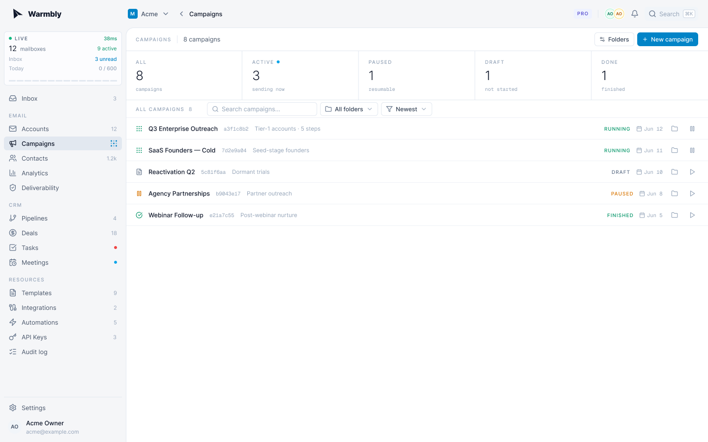
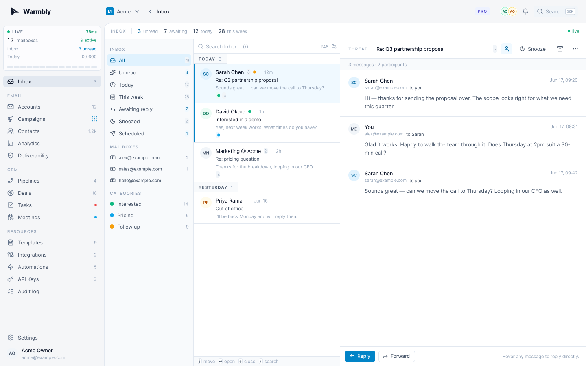
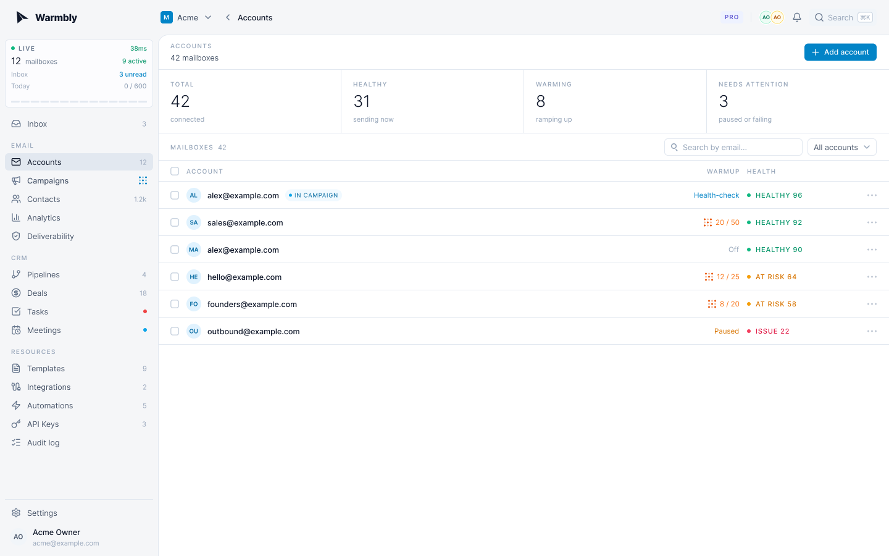

<p align="center">
  
</p>

<p align="center">
  Open-source cold email and mailbox warmup you can self-host.<br />
  Your sending IPs, your database, your servers.
</p>

<p align="center">
  <a href="https://github.com/warmbly/warmbly/actions/workflows/ci.yml"></a>
  <a href="https://github.com/warmbly/warmbly/releases"></a>
  
  <a href="./LICENSE"></a>
  <a href="https://docs.warmbly.com"></a>
</p>

<p align="center">
  <a href="#connect-your-mailboxes">Mailboxes</a> ·
  <a href="#integrations">Integrations</a> ·
  <a href="#quick-start">Quick start</a> ·
  <a href="#warmup">Warmup</a> ·
  <a href="#how-it-works">How it works</a> ·
  <a href="#self-hosting">Self-hosting</a> ·
  <a href="#documentation">Docs</a> ·
  <a href="./CONTRIBUTING.md">Contributing</a>
</p>

<p align="center">
  <br />
  <sub><b>Campaigns</b> · multi-step sequences with per-mailbox daily caps and spacing</sub>
</p>

<p align="center">
  <br />
  <sub><b>Unified inbox</b> · every connected mailbox and reply in one place</sub>
</p>

<p align="center">
  <br />
  <sub><b>Mailboxes</b> · warmup state and health for every account</sub>
</p>

## What is Warmbly

Warmbly is a cold outreach platform. You connect your mailboxes, write sequenced
campaigns, and it sends the mail, tracks the replies, and keeps your sender
reputation healthy. The difference from hosted tools is where it runs: your
sending IPs, your Postgres, your servers. Nothing is tied to a vendor's database.

Everything a sending team needs sits in one dashboard:

- **Campaigns** send multi-step sequences with per-mailbox daily caps and spacing.
- **The unified inbox** pulls every connected mailbox and its replies into one view.
- **A built-in CRM** tracks contacts, pipelines, deals, tasks, and meetings.
- **Deliverability** surfaces bounces, complaints, suppression, and inbox placement.
- **Automations** run branching reply playbooks on a visual canvas.
- **Integrations** sync the CRM and automations out to HubSpot, Slack, and more.
- **Warmup** builds real sender reputation through our pool, covered next.

The dashboard is collaborative in real time: teammates see each other's live
cursors, presence, and edits across campaigns, the CRM, and the automation
canvas, with no refresh.

The same code runs on a single VPS or across a fleet of cheap servers with many
IPs per box, so you add capacity by adding machines.

## Connect your mailboxes

Warmbly sends and receives through the mailboxes you already own. There are three
ways to connect one, and you can mix them freely across a workspace:

- **Google / Gmail and Google Workspace.** Connect with one-click OAuth, no app
  password to store or rotate. Sending goes through the Gmail API.
- **Microsoft 365 / Outlook.** Connect with one-click OAuth over authenticated
  SMTP and IMAP.
- **Any other provider over SMTP + IMAP.** Zoho, Fastmail, a self-hosted mail
  server, anything that speaks SMTP and IMAP. Add the host, port, and an app
  password.

Each mailbox warms, sends, and syncs on its own, with its own daily cap, minimum
spacing between sends, and reputation tracked per IP. Replies stream into the
unified inbox in near real time. Credentials and OAuth tokens are sealed with
per-organization envelope encryption and are only decrypted on the worker that
owns the mailbox, never stored in plaintext.

## Integrations

Automations and the built-in CRM connect out to the tools you already run: ping
Slack on a positive reply, push a won deal to your CRM, book meetings straight
from replies, or fan events out to your own stack.

| Category      | Providers                              |
|---------------|----------------------------------------|
| CRM           | HubSpot, Salesforce, Pipedrive, Close  |
| Automation    | Zapier, Make, n8n                      |
| Notifications | Slack, Discord                         |
| Meetings      | Calendly, Cal.com                      |
| Data          | Google Sheets                          |

Everything is also reachable through a scoped REST API, HMAC-signed webhooks, and
a realtime WebSocket, so you can wire Warmbly into anything that is not on the
list. Open tracking, click tracking, and reply detection feed the same event
stream. See the [API reference](https://docs.warmbly.com/api/).

## Warmup

Warmup only produces meaningful results with a pool of real mailboxes warming
against each other. Warmbly maintains that pool, so the practical path to real
reputation is to run warmup through Warmbly: your mailboxes hold genuine
conversations with monitored inboxes instead of throwaway accounts, even if you
only have a few. If you operate enough mailboxes of your own to sustain a healthy
pool, you can host warmup yourself instead.

Either way the safeguards are the same. Volume starts low and ramps gradually per
mailbox, replies happen at a natural rate, and every warmup message carries a
verification token. Mailboxes that show spam patterns or forged tokens are scored
and auto-blocked from the pool, so it stays clean for everyone in it. Free and
premium pools are kept separate.

## Quick start

You need Docker, Go 1.25, and pnpm.

```bash
git clone https://github.com/warmbly/warmbly && cd warmbly
make dev
```

That one command brings up the backing services in Docker, waits for them to be
ready, applies migrations, seeds demo data, and starts the backend, consumer,
both workers, and the dashboard together in your terminal. Open
`http://localhost:5173` and log in with `dev@warmbly.com` / `password123`.
Ctrl-C stops the app; the Docker infra stays up so the next `make dev` is fast.

The Go services run natively (recompiling in a second or two on save), so the
same command is also the day-to-day loop. If you prefer separate terminals, the
stack splits into `make infra` + `make run` + `make web`. To run everything in
Docker instead, use `make up`.

The first admin account cannot be created from the UI. Sign up through the
dashboard, then promote yourself from the host with
`make grant-admin EMAIL=you@example.com` and open the admin app with `make admin`.
Full local setup, seeding, and troubleshooting live in the
[local development guide](https://docs.warmbly.com/development/local-development/).

## How it works

Warmbly is split into a control plane and an execution plane.

The control plane is the backend API, the event consumer, Postgres, Redis, and
the event bus. It owns every piece of stateful data and decides what gets sent
and from where.

The execution plane is the worker fleet: one Go binary per machine, one worker
process per IP. Workers take commands off the event bus, fetch their encryption
keys over HTTPS, send and sync mail, and report telemetry back. **Workers never
connect to Postgres.** Each one is a sending identity rather than a database
client, so outbound volume spreads across many IPs instead of piling up in a
single runtime. Reputation is tracked per IP.

Secrets use envelope encryption: a per-organization data key, wrapped by KMS, is
what seals mailbox credentials and message content. The full write-up is in the
[architecture docs](https://docs.warmbly.com/development/architecture/).

## Self-hosting

Every external dependency has an open-source path, picked with an environment
variable, so a self-hosted install can run without any cloud account.

| Concern        | Self-host default         | Cloud option            |
|----------------|---------------------------|-------------------------|
| Database       | PostgreSQL 16             | RDS / Cloud SQL         |
| Cache          | Redis (or Valkey)         | ElastiCache             |
| Event bus      | NATS JetStream (1 binary) | Kafka, MSK              |
| Blob storage   | Filesystem                | S3, MinIO, R2, B2       |
| KMS / root key | Local AES master key      | AWS KMS, Vault, GCP     |
| Codec          | JSON                      | Avro + Schema Registry  |
| Captcha        | Bypass token (trusted)    | Cloudflare Turnstile    |
| Payments       | Off                       | Stripe                  |

One machine with several attached IPs becomes several sending identities in a
single command. Each IP gets its own systemd unit and a stable identity, so
reputation survives reinstalls:

```bash
sudo ./scripts/install-worker.sh \
  --kafka kafka.yourdomain.com:9092 \
  --redis redis://cache.yourdomain.com:6379 \
  --ips 5.6.7.11,5.6.7.12,5.6.7.13
```

Production deployment, the full env reference, and day-2 operations are in the
[deployment guide](https://docs.warmbly.com/development/deployment-guide/).

## Tech stack

| Component   | Tech                              |
|-------------|-----------------------------------|
| Backend API | Go 1.25 + Gin                     |
| Consumer    | Go (event-bus driven)             |
| Worker      | Go (Kafka / NATS subscriber)      |
| Tracking    | Rust + Axum                       |
| Realtime    | Elixir + Phoenix Channels         |
| Dashboard   | React 19 + Vite + Tailwind v4     |
| Admin UI    | React 19 + Vite + Tailwind v4     |
| Database    | PostgreSQL 16                     |
| Cache       | Redis 7 (or Valkey / KeyDB)       |
| Event bus   | NATS JetStream (default) or Kafka |

## Documentation

| Doc | What it covers |
|-----|----------------|
| [Architecture](https://docs.warmbly.com/development/architecture/) | Control plane vs execution plane, encryption model |
| [Local development](https://docs.warmbly.com/development/local-development/) | Make targets, native services, seeding |
| [Deployment guide](https://docs.warmbly.com/development/deployment-guide/) | Production control plane and worker fleet |
| [Event system](https://docs.warmbly.com/development/events/) | Kafka event bus reference |
| [docs.warmbly.com](https://docs.warmbly.com) | Product guides and public API reference |

## Contributing

Pull requests are welcome. Keep each one to a single logical change, and open an
issue first for larger design or product changes. Before you open a PR, run the
checks for the tree you touched (`make fmt` and `make lint` for Go, `pnpm
typecheck` and `pnpm lint` for the frontends). See [CONTRIBUTING.md](CONTRIBUTING.md).

## Security

Found a vulnerability? Email `team@warmbly.com` instead of opening a public issue.
We prefer responsible disclosure and credit reporters in the release notes.

## License

Apache License 2.0. Copyright 2026 Mindroot Ltd. See [LICENSE](./LICENSE).
