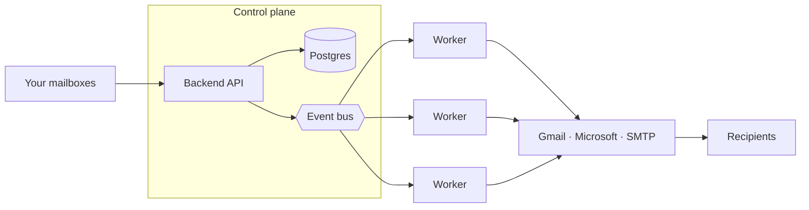

<div align="center">
  <picture>
    <source media="(prefers-color-scheme: dark)" srcset="docs/assets/logo-dark.svg">
    <source media="(prefers-color-scheme: light)" srcset="docs/assets/logo-light.svg">
    
  </picture>

  <p>
    <b>Open-source cold email and mailbox warmup you can self-host.</b><br />
    Connect your mailboxes, run sequenced campaigns, and warm your sender reputation, all on your own IPs and database.
  </p>

  <p>
    <a href="https://github.com/warmbly/warmbly/actions/workflows/ci.yml"></a>
    <a href="https://github.com/warmbly/warmbly/releases"></a>
    
    <a href="./LICENSE"></a>
  </p>

  <p>
    <a href="https://dc.warmbly.com"></a>
    <a href="https://docs.warmbly.com"></a>
    <a href="https://github.com/warmbly/warmbly/stargazers"></a>
  </p>

  <p>
    <a href="#features">Features</a> ·
    <a href="#how-it-works">How it works</a> ·
    <a href="#quick-start">Quick start</a> ·
    <a href="#self-hosting">Self-hosting</a> ·
    <a href="#documentation">Docs</a> ·
    <a href="#community">Community</a>
  </p>
</div>

https://github.com/user-attachments/assets/378a510a-bb99-425f-925e-04300184938b

## What is Warmbly

Warmbly is a cold outreach platform you run on your own infrastructure. Connect
the mailboxes you already own, write multi-step campaigns, and Warmbly sends the
mail, tracks every open, click, and reply, and warms your sender reputation so
more of it lands in the inbox.

The difference from hosted tools is where it runs: your sending IPs, your
Postgres, your servers. Nothing is tied to a vendor's database, and the same code
runs on a single VPS or a fleet of cheap machines.

## Features

- **Campaigns** send multi-step sequences with per-mailbox daily caps and spacing.
- **Unified inbox** pulls every connected mailbox and its replies into one view.
- **Built-in CRM** tracks contacts, pipelines, deals, tasks, and meetings.
- **Warmup** builds real sender reputation through a pool of monitored mailboxes.
- **Deliverability** surfaces bounces, complaints, suppression, and inbox placement.
- **Automations** run branching reply playbooks on a visual canvas, with AI steps that read a reply and act on it.
- **Integrations** sync out to HubSpot, Slack, Zapier, and more, plus a REST API, webhooks, and a realtime WebSocket.
- **Real-time and collaborative** so teammates see each other's presence and edits with no refresh.

<p align="center">
  
  
</p>

## How it works

Warmbly splits into a **control plane** (backend API, consumer, Postgres, Redis,
and the event bus) that owns all state, and an **execution plane** of
interchangeable Go workers that send and sync mail. Workers never touch Postgres,
and outbound mail leaves through each mailbox's own provider, not the worker's IP,
so you add throughput by running more workers.



Secrets use envelope encryption, with a local AES master key by default or AWS KMS
if you prefer. Full write-up in the
[architecture docs](https://docs.warmbly.com/development/architecture/).

## Quick start

You need Docker, Go 1.25, and pnpm.

```bash
git clone https://github.com/warmbly/warmbly && cd warmbly
make dev
```

One command brings up the backing services in Docker, applies migrations, seeds
demo data, and starts the backend, worker, and dashboard natively. Open
`http://localhost:5173` and log in with `dev@warmbly.com` / `password123`. Full
setup lives in the
[local development guide](https://docs.warmbly.com/development/local-development/).

## Self-hosting

Warmbly runs with **no cloud account of any kind**: no AWS, no GCP, no Stripe, no
Kafka. One command brings up the whole platform on local, open-source pieces:

```bash
git clone https://github.com/warmbly/warmbly && cd warmbly
make up               # or: docker compose up --build
```

Every external dependency is picked by an environment variable, so you swap in a
cloud service only if you want one:

| Concern        | Self-host default          | Optional / cloud             |
|----------------|----------------------------|------------------------------|
| Database       | PostgreSQL 16              | RDS / Cloud SQL, any Postgres |
| Cache          | Redis (or Valkey)         | ElastiCache                  |
| Event bus      | **NATS JetStream**        | Kafka (`-tags kafka`)        |
| Blob storage   | **Filesystem**            | S3, MinIO, R2, B2            |
| KMS / root key | **Local AES master key**  | AWS KMS                      |
| Payments       | **Off (everything unlocked)** | Stripe                   |

Scaling is by mailboxes and workers, not IPs. Reaching it from another machine,
connecting Gmail, and day-2 operations are all in the
[deployment guide](https://docs.warmbly.com/development/deployment-guide/).

## Documentation

The full docs live at **[docs.warmbly.com](https://docs.warmbly.com)**.

| Read this | To learn |
|-----------|----------|
| [Local development](https://docs.warmbly.com/development/local-development/) | Every make target, the native services, and how seeding works |
| [Architecture](https://docs.warmbly.com/development/architecture/) | How the control plane and workers split the job, plus the encryption model |
| [Deployment guide](https://docs.warmbly.com/development/deployment-guide/) | Taking it to production and scaling the worker fleet |
| [API reference](https://docs.warmbly.com/api/) | Endpoints, auth, permissions, and webhooks |

## Community

Have a question, found a bug, or want to shape where Warmbly goes next?

- **[Discord](https://dc.warmbly.com)** - chat with the team and other senders
- **[GitHub Issues](https://github.com/warmbly/warmbly/issues)** - report bugs and request features
- **Email** - reach us at `team@warmbly.com`

## Star the repository ⭐


## Contributing

Pull requests are welcome. Keep each one to a single logical change, and open an
issue first for larger design or product changes. Before you open a PR, run the
checks for the tree you touched (`make fmt` and `make lint` for Go, `pnpm
typecheck` and `pnpm lint` for the frontends). See [CONTRIBUTING.md](CONTRIBUTING.md).

## Security

Found a vulnerability? Email `team@warmbly.com` instead of opening a public issue.
We prefer responsible disclosure and credit reporters in the release notes.

## License

Apache License 2.0. Copyright 2026 Mindroot Ltd. See [LICENSE](./LICENSE).
