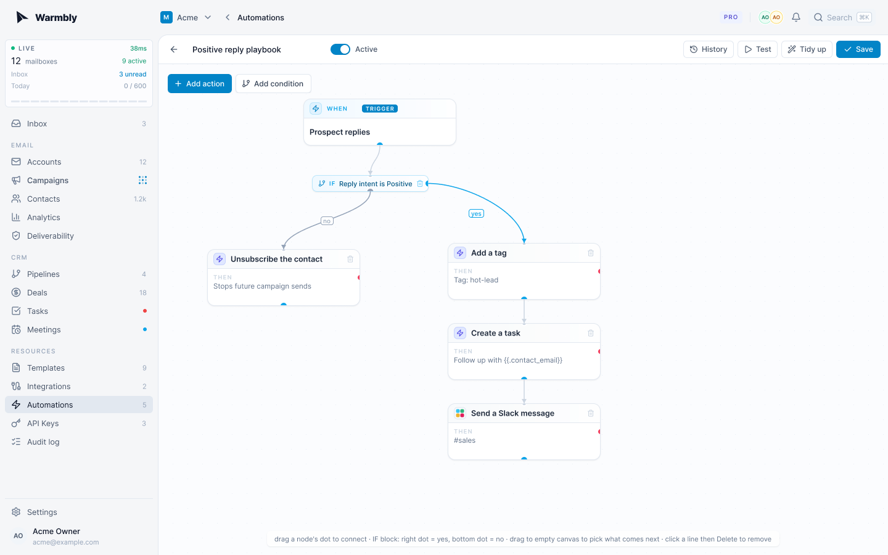

<p align="center">
  
</p>

<p align="center">
  <b>Open-source cold email and mailbox warmup you can self-host.</b><br />
  Your IPs, your database, your infrastructure. No vendor lock-in.
</p>

<p align="center">
  <a href="./LICENSE"></a>
  &nbsp;
  &nbsp;
  &nbsp;
  &nbsp;<a href="./CONTRIBUTING.md"></a>
</p>

<p align="center">
  <a href="#features">Features</a> ·
  <a href="#quick-start">Quick start</a> ·
  <a href="#how-it-works">How it works</a> ·
  <a href="#self-hosting">Self-hosting</a> ·
  <a href="#documentation">Docs</a> ·
  <a href="./CONTRIBUTING.md">Contributing</a>
</p>

---

<table>
  <tr>
    <td width="50%"><br /><sub><b>Campaigns</b> · multi-step sends with live per-mailbox caps and status</sub></td>
    <td width="50%"><br /><sub><b>Unified inbox</b> · every mailbox and reply in one place</sub></td>
  </tr>
  <tr>
    <td width="50%"><br /><sub><b>Deliverability</b> · bounce, complaint, and inbox-placement health</sub></td>
    <td width="50%"><br /><sub><b>Automations</b> · branching reply playbooks on a visual canvas</sub></td>
  </tr>
</table>

## What is Warmbly

Warmbly is a cold-outreach and mailbox-warmup platform that runs on infrastructure
you control. Hosted tools keep your sender reputation in someone else's IP pool and
your data in someone else's database. Warmbly gives you the same feature set on your
own boxes: your IPs, your Postgres, no vendor lock-in.

The same code scales from a single VPS to a fleet of cheap servers with many IPs per
box, so you start small and add capacity by adding machines, not by paying per seat.

## Features

- **Self-hostable** — one binary per service. Postgres, Redis, and an event bus are the whole stack. No required calls to AWS, GCP, Stripe, or Cloudflare.
- **Distributed workers** — one worker per IP, many per box. Reputation is tracked per IP, not per machine, and a multi-IP install is a single command.
- **Real warmup** — pool-based warmup with spam-score tracking and auto-blocking on token-forgery patterns. Free and premium pools stay isolated.
- **Mailbox-first safety** — per-mailbox send caps and spacing with gradual ramps. A worker's safe volume is the sum of its mailboxes' budgets, not a flat per-worker limit.
- **Envelope encryption** — KMS-wrapped per-organization data keys. Workers fetch them over HTTPS and never touch Postgres directly.
- **Pluggable backends** — KMS, blob store, event bus, and codec are chosen at deploy time: AWS or local AES, Kafka or NATS, S3 or filesystem.
- **A real product** — campaigns, unified inbox, CRM, deliverability analytics, visual automations, and a separate admin app, all realtime by default.

## Quick start

You'll need Docker, Go 1.25, and pnpm.

```bash
git clone https://github.com/warmbly/warmbly && cd warmbly

make infra   # Postgres, Redis, Kafka + supporting services (run once, leave up)
make app     # backend, consumer, worker, tracking, realtime, dashboard

open http://localhost:5173
```

For the fastest dev loop, run the Go services natively (no image rebuilds on change):

```bash
make infra            # once
make run              # backend + consumer + worker in one terminal
make web              # dashboard → http://localhost:5173
```

The admin app needs an account with admin permissions, and there's no way to
bootstrap the first one from the UI. Sign up through the dashboard, then promote
yourself from the host:

```bash
make grant-admin EMAIL=you@example.com   # then: make admin → http://localhost:5174
```

Full local-dev reference (native services, seeding, troubleshooting):
[resources/local-development.md](resources/local-development.md).

## How it works

Warmbly splits into a control plane and an execution plane.

The **control plane** is the backend API, the event consumer, Postgres, Redis, and
the event bus. It owns all stateful data and decides what to send and where.

The **execution plane** is the distributed worker fleet: one Go binary per machine,
one worker process per IP. Workers receive commands over the event bus, fetch their
encryption keys over HTTPS, send and sync mail, and emit telemetry back. **Workers
never connect to Postgres.**

That separation is the point. Workers scale horizontally across many cheap machines,
each one a sending identity rather than a database client, so outbound volume spreads
across many IPs instead of concentrating in one runtime. Full write-up:
[resources/architecture.md](resources/architecture.md).

## Self-hosting

Every external dependency has an open-source path, selected by an environment
variable. A self-hoster pays only for the boxes they rent.

| Concern        | Self-host default         | Cloud option            |
|----------------|---------------------------|-------------------------|
| Database       | PostgreSQL 16             | RDS / Cloud SQL         |
| Cache          | Redis (or Valkey)         | ElastiCache             |
| Event bus      | NATS JetStream (1 binary) | Kafka, MSK              |
| Blob storage   | Filesystem                | S3, MinIO, R2, B2       |
| KMS / root key | Local AES master key      | AWS KMS, Vault, GCP     |
| Codec          | JSON                      | Avro + Schema Registry  |
| Captcha        | Bypass token (trusted)    | Cloudflare Turnstile    |
| Payments       | Off                       | Stripe                  |

One machine with many attached IPs becomes many sending identities in a single
command. Each IP gets its own systemd unit and a deterministic identity, so
reputation persists across reinstalls:

```bash
sudo ./scripts/install-worker.sh \
  --kafka kafka.yourdomain.com:9092 \
  --redis redis://cache.yourdomain.com:6379 \
  --ips 5.6.7.11,5.6.7.12,5.6.7.13
```

Production control plane + worker fleet, env reference, and day-2 operations:
[resources/deployment-guide.md](resources/deployment-guide.md).

## Tech stack

| Component   | Tech                              |
|-------------|-----------------------------------|
| Backend API | Go 1.25 + Gin                     |
| Consumer    | Go (event-bus driven)             |
| Worker      | Go (Kafka / NATS subscriber)      |
| Tracking    | Rust + Axum                       |
| Realtime    | Elixir + Phoenix Channels         |
| Dashboard   | React 19 + Vite + Tailwind v4     |
| Admin UI    | React 19 + Vite + Tailwind v4     |
| Database    | PostgreSQL 16                     |
| Cache       | Redis 7 (or Valkey / KeyDB)       |
| Event bus   | NATS JetStream (default) or Kafka |

## Repository layout

```
cmd/        backend (API), consumer (events → Postgres), worker (one per IP), seed
internal/   api · app (business services) · client (SMTP/IMAP) · events ·
            infrastructure (pluggable codec/eventbus/kms/storage) · repository
tracking/   Rust open/click service        realtime/   Elixir WebSocket gateway
web/        user dashboard                  admin/      admin UI
site/       marketing site (Astro)          docs/       docs site (docs.warmbly.com)
scripts/    worker installer + dev tooling  resources/  architecture + design notes
```

## Documentation

| Doc | What it covers |
|-----|----------------|
| [resources/architecture.md](resources/architecture.md) | Control plane vs execution plane, encryption model |
| [resources/local-development.md](resources/local-development.md) | Make targets, native services, seeding |
| [resources/deployment-guide.md](resources/deployment-guide.md) | Production control plane + worker fleet |
| [resources/Events.md](resources/Events.md) | Event bus reference |
| [resources/EMSG.md](resources/EMSG.md) | Encrypted-message blob format |
| [docs.warmbly.com](https://docs.warmbly.com) | Product guides and public API reference |

## Contributing

Pull requests are welcome. Keep changes scoped to one logical change, and open an
issue first for larger design or product changes. Before you open a PR, run the
checks for the tree you touched (`make fmt` + `make lint` for Go; `pnpm typecheck` +
`pnpm lint` for the frontends). Details in [CONTRIBUTING.md](CONTRIBUTING.md).

## Security

Found a vulnerability? Email `security@warmbly.com` rather than opening a public
issue. We prefer responsible disclosure and credit reporters in the release notes.
The encryption model is documented in [resources/architecture.md](resources/architecture.md).

## License

Apache License 2.0. Copyright 2026 Mindroot Ltd. See [LICENSE](./LICENSE).
