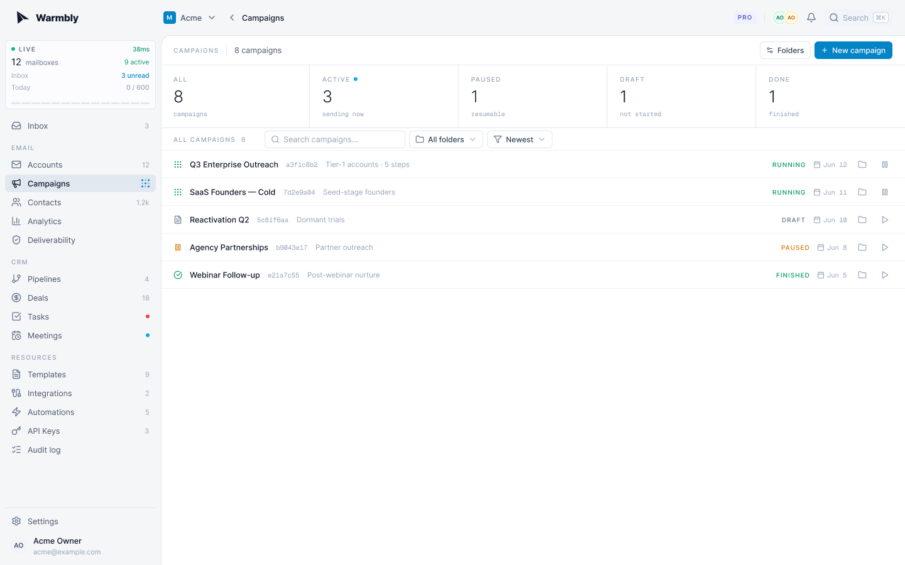
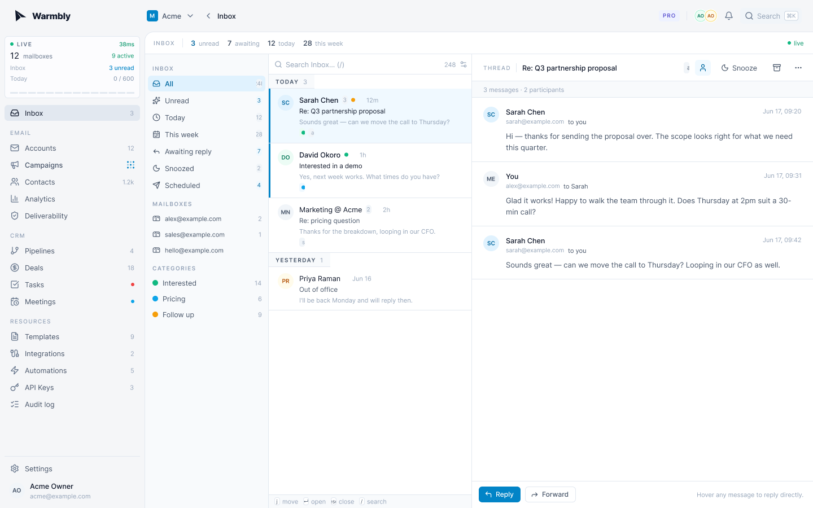
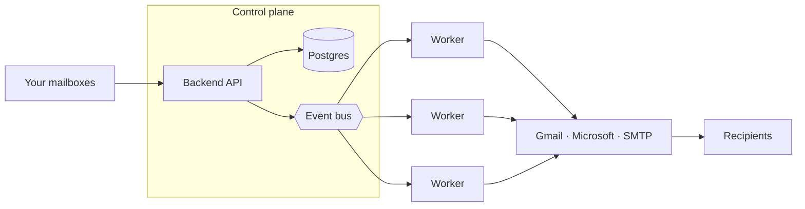

<div align="center">
  <picture>
    <source media="(prefers-color-scheme: dark)" srcset="docs/assets/logo-dark.svg">
    <source media="(prefers-color-scheme: light)" srcset="docs/assets/logo-light.svg">
    
  </picture>

  <p>The open-source agentic cold email and warmup platform.</p>

  <p>
    <a href="https://dc.warmbly.com"></a>
    <a href="https://x.com/WarmblyHQ"></a>
    <a href="https://docs.warmbly.com"></a>
    <a href="https://github.com/warmbly/warmbly/actions/workflows/ci.yml"></a>
    <a href="https://github.com/warmbly/warmbly/releases"></a>
    <a href="./LICENSE"></a>
  </p>

  <p>
    <a href="#features">Features</a> ·
    <a href="#how-it-works">How it works</a> ·
    <a href="#quick-start">Quick start</a> ·
    <a href="#self-hosting">Self-hosting</a> ·
    <a href="#documentation">Docs</a> ·
    <a href="#community">Community</a> ·
    <a href="#support-and-enterprise">Support</a>
  </p>

  <p><i>⭐ Help us reach more senders and grow the Warmbly community. Star this repo!</i></p>
</div>

## Warmbly

Warmbly runs cold email campaigns from the mailboxes you already own and warms
them so they keep landing in the inbox. Opens, clicks, and replies land in a
shared dashboard the moment they happen, and it's AI-native, so your team and its
agents work in it together, live.

https://github.com/user-attachments/assets/378a510a-bb99-425f-925e-04300184938b

## Features

- **Campaigns** - multi-step sequences with per-mailbox caps and spacing
- **Unified inbox** - every mailbox and reply in one place
- **CRM** - contacts, pipelines, deals, tasks, meetings
- **Warmup** - a pool of monitored mailboxes, not throwaway accounts
- **Deliverability** - bounces, complaints, suppression, inbox placement
- **Automations** - visual reply playbooks with AI steps
- **Integrations** - HubSpot, Slack, Zapier, REST API, webhooks
- **Realtime** - live presence and edits across your team

<p align="center">
  
  
</p>

## How it works

Warmbly splits into a **control plane** (backend API, consumer, Postgres, Redis,
and the event bus) that owns all state, and an **execution plane** of
interchangeable Go workers that send and sync mail. Workers never touch Postgres,
and outbound mail leaves through each mailbox's own provider, not the worker's IP,
so you add throughput by running more workers.


```mermaid
flowchart LR
  MB["Your mailboxes"] --> API
  subgraph CP["Control plane"]
    direction TB
    API["Backend API"] --> DB[("Postgres")]
    API --> BUS{{"Event bus"}}
  end
  BUS --> W1["Worker"]
  BUS --> W2["Worker"]
  BUS --> W3["Worker"]
  W1 --> P["Gmail · Microsoft · SMTP"]
  W2 --> P
  W3 --> P
  P --> R["Recipients"]
```

Secrets use envelope encryption, with a local AES master key by default or AWS KMS
if you prefer. Full write-up in the
[architecture docs](https://docs.warmbly.com/development/architecture/).

## Quick start

You need Docker, Go 1.25, and pnpm.

```bash
git clone https://github.com/warmbly/warmbly && cd warmbly
make dev
```

Open `http://localhost:5173` and log in with `dev@warmbly.com` / `password123`;
the login code lands in Mailpit at `http://localhost:18025`. Every make target,
the native services, and how seeding works are in the
[local development guide](https://docs.warmbly.com/development/local-development/).

> [!WARNING]
> `make dev` and `make up` share one database, and seeded fixture accounts claim
> the instance. Planning to self-host from the same machine? Read
> [first run](https://docs.warmbly.com/development/first-run/) first.

## Self-hosting

<a href="https://docs.warmbly.com/development/deployment-guide/"></a>

Warmbly runs with **no cloud account of any kind**: no AWS, no GCP, no Stripe, no
Kafka. One command brings up the whole platform on local, open-source pieces:

```bash
git clone https://github.com/warmbly/warmbly && cd warmbly
make up
```

That is the whole install: `make up` waits for the backend and prints a one-time
link that claims the instance and makes you its admin. You need Docker with
Compose v2 and about 10 GB of free disk. If anything looks wrong, `make doctor`
prints the instance state and every failing check.

From here the
[self-hosting guide](https://docs.warmbly.com/development/deployment-guide/)
covers the rest: your own secrets, production hardening, mail and single
sign-on, HTTPS, connecting Gmail and Microsoft mailboxes, scaling workers, and
backups. Account recovery and every operator command live in
[`warmblyctl`](https://docs.warmbly.com/development/warmblyctl/), the CLI baked
into the backend image; it talks to the database directly, so it works when
signing in does not.

## Documentation

The full docs live at **[docs.warmbly.com](https://docs.warmbly.com)**.

| Read this | To learn |
|-----------|----------|
| [Self-hosting guide](https://docs.warmbly.com/development/deployment-guide/) | Step-by-step install, then production, backups, and scaling the worker fleet |
| [First run](https://docs.warmbly.com/development/first-run/) | Claiming the instance, reissuing the setup link, and what to do when accounts already exist |
| [Accounts and access](https://docs.warmbly.com/development/accounts-and-access/) | Registration modes, inviting people with or without a mail relay, SSO, and recovering access |
| [`warmblyctl`](https://docs.warmbly.com/development/warmblyctl/) | The operator CLI: creating accounts, setting passwords, granting admin, and instance status |
| [Configuration reference](https://docs.warmbly.com/development/configuration/) | Every environment variable, its default, and whether changing it needs a restart |
| [Instance health](https://docs.warmbly.com/development/instance-health/) | The checks the admin panel runs against your deployment, and `make doctor` |
| [Troubleshooting](https://docs.warmbly.com/development/troubleshooting/) | The errors self-hosters actually hit, and the command that fixes each one |
| [Local development](https://docs.warmbly.com/development/local-development/) | Every make target, the native services, and how seeding works |
| [Architecture](https://docs.warmbly.com/development/architecture/) | How the control plane and workers split the job, plus the encryption model |
| [API reference](https://docs.warmbly.com/api/) | Endpoints, auth, permissions, and webhooks |

## Community

Have a question, found a bug, or want to shape where Warmbly goes next?

- **[Discord](https://dc.warmbly.com)** - chat with the team and other senders
- **[GitHub Issues](https://github.com/warmbly/warmbly/issues)** - report bugs and request features
- **[X / @WarmblyHQ](https://x.com/WarmblyHQ)** - follow along for updates and releases
- **Email** - reach us at `team@warmbly.com`

## Support and enterprise

> [!NOTE]
> <i>**Need a hand? We are happy to help.** Ask in [Discord](https://dc.warmbly.com), open a [GitHub issue](https://github.com/warmbly/warmbly/issues), or email `team@warmbly.com`, and someone on the team will get back to you.</i>
>
> <i>**Running Warmbly at scale, or would you rather we run it for you?** We offer **enterprise support** and **managed infrastructure**: we can host and operate the whole platform for your organization, help you deploy and scale the worker fleet, tune deliverability, migrate your sending onto Warmbly, and stand behind it with a support agreement built around your team. Tell us what you need at `team@warmbly.com` or reach out on X.</i>

<p>
  <a href="https://x.com/WarmblyHQ"></a>
  <a href="https://dc.warmbly.com"></a>
  <a href="mailto:team@warmbly.com"></a>
</p>

## Star the repository ⭐


## Contributing

Pull requests are welcome. Keep each one to a single logical change, and open an
issue first for larger design or product changes. Before you open a PR, run the
checks for the tree you touched (`make fmt` and `make lint` for Go, `pnpm
typecheck` and `pnpm lint` for the frontends). See [CONTRIBUTING.md](CONTRIBUTING.md).

## Security

Found a vulnerability? Email `team@warmbly.com` instead of opening a public issue.
We prefer responsible disclosure and credit reporters in the release notes.

## License

Apache License 2.0. Copyright 2026 Mindroot Ltd. See [LICENSE](./LICENSE).
